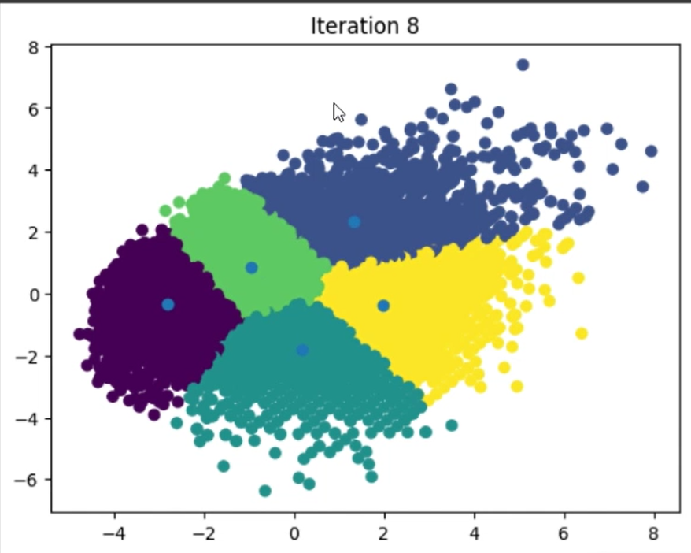

# K-Means Clustering on FIFA 22 Player Data

An implementation of the **K-Means clustering algorithm from scratch** to discover hidden patterns in the **FIFA 22 player dataset**.  
This project groups footballers based on key statistics, revealing non-intuitive similarities that go beyond simple ratings.

---

## About The Project

As a fan of the FIFA video game series, I wanted to integrate my passion for football with a hands-on AI project.  
This repository is the result of that goal: a **custom-built K-Means algorithm** that analyzes and clusters professional footballers based on metrics like **age, overall rating, potential, and wages**.

The core of this project is to demonstrate how **unsupervised learning** can uncover interesting relationships in a familiar dataset.  
By building the algorithm from the ground up, I was also able to compare it directly with the **optimized scikit-learn implementation**.

---

## Key Features

- **Custom K-Means Algorithm** — A from-scratch implementation of the K-Means clustering algorithm.  
- **Data-Driven Insights** — Reveals statistical similarities between footballers that might not be immediately obvious.  
- **Comparative Analysis** — Performance comparison between the custom implementation and scikit-learn’s K-Means.  
- **Advanced Techniques** — Uses **PCA** for dimensionality reduction and **Min-Max Scaling** for normalization.  
- **Rich Visualizations** — Cluster plots made with `matplotlib` for clear visual interpretation.

---

## Demo

Here is a short video showcasing the iterative process of the custom K-Means algorithm.  
Notice how the cluster centroids adjust with each iteration — convergence speed may vary with each run.

[](https://www.youtube.com/watch?v=gzPCtg2uFXQ)

---

## Tech Stack

Built in **Jupyter Notebook** using the following data science libraries:

- `pandas` — Data manipulation and FIFA 22 dataset loading  
- `numpy` — Numerical operations and array handling  
- `matplotlib` — Visualizing player clusters  
- `scikit-learn` — PCA, scaling, and benchmark comparison  
- `IPython` — Display utilities for the Jupyter environment  

---

## Getting Started

Follow these simple steps to set up the project locally.

### Prerequisites

Ensure you have **Python** and **pip** installed on your system.

### Installation

Clone the repository:
```bash
git clone https://github.com/aditudor30/K-Means-Clustering-FIFA-Ratings.git
```

Navigate to the project directory:
```bash
cd K-Means-Clustering-FIFA-Ratings
```

Install the dependencies:
```bash
pip install -r requirements.txt
```

---

## Usage

The project is contained in a **Jupyter Notebook** (`.ipynb`) file.

To explore the code and visualize results:

1. Start Jupyter Notebook:
   ```bash
   jupyter notebook
   ```
2. Open the notebook file in your browser.
3. Run the cells sequentially to follow the full process — from **data loading** and **cleaning** to **clustering** and **visualization**.

---

## Contributing

Contributions and suggestions are welcome!  
If you have ideas for improvements or find bugs, feel free to fork the repo and create a pull request.

1. Fork the Project  
2. Create your Feature Branch  
   ```bash
   git checkout -b feature/AmazingFeature
   ```
3. Commit your Changes  
   ```bash
   git commit -m 'Add some AmazingFeature'
   ```
4. Push to the Branch  
   ```bash
   git push origin feature/AmazingFeature
   ```
5. Open a Pull Request  

---

## Author

**Adi Tudor**  
Initial work – [@aditudor30](https://github.com/aditudor30)

---
